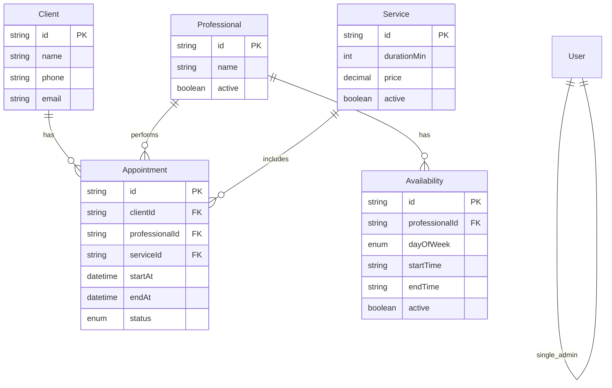
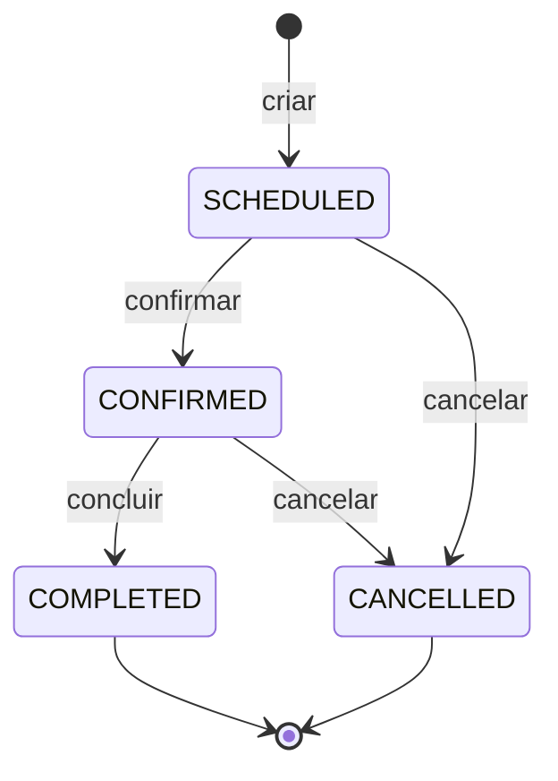
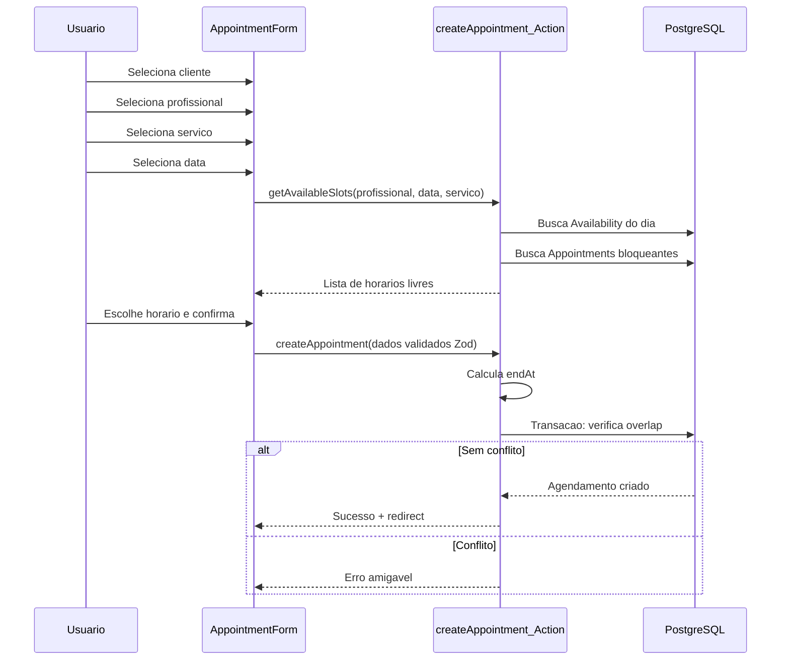
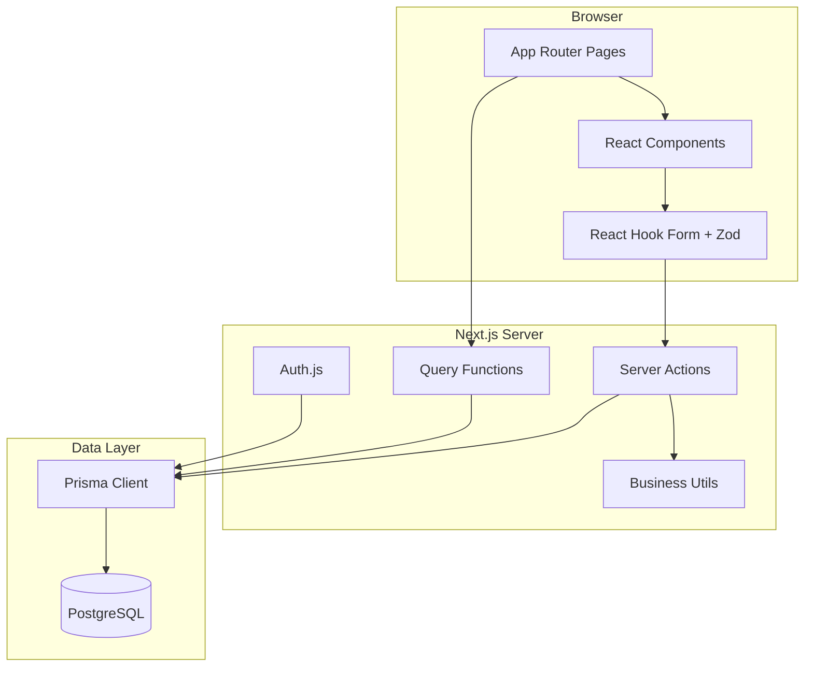

# Plano Técnico — Agendei

Sistema web de agendamento de serviços para salões, clínicas, oficinas e consultorias. Projeto de portfólio com estrutura profissional, interface em português e foco em simplicidade para usuários não técnicos.

## Contexto atual

O repositório já possui:

- **Next.js 16.2.9** (App Router) + **React 19** + **TypeScript**
- **Tailwind CSS 4** configurado em `src/app/globals.css`
- Scaffold padrão em `src/app/page.tsx` — ainda sem Prisma, Zod, React Hook Form ou autenticação

**Decisão de escopo confirmada:** autenticação simples com **um usuário admin**.

---

## 1. Estrutura de pastas

Organização por responsabilidade, seguindo convenções do App Router:

```
agendei/
├── prisma/
│   ├── schema.prisma          # Modelos e enums
│   ├── seed.ts                # Dados de demonstração
│   └── migrations/
├── src/
│   ├── app/
│   │   ├── (auth)/
│   │   │   ├── login/
│   │   │   │   └── page.tsx
│   │   │   └── layout.tsx     # Layout minimalista (sem sidebar)
│   │   ├── (dashboard)/
│   │   │   ├── layout.tsx       # Shell: sidebar + header
│   │   │   ├── page.tsx       # Dashboard
│   │   │   ├── clientes/
│   │   │   │   ├── page.tsx
│   │   │   │   ├── novo/page.tsx
│   │   │   │   └── [id]/editar/page.tsx
│   │   │   ├── profissionais/
│   │   │   │   ├── page.tsx
│   │   │   │   ├── novo/page.tsx
│   │   │   │   └── [id]/editar/page.tsx
│   │   │   ├── servicos/
│   │   │   │   ├── page.tsx
│   │   │   │   ├── novo/page.tsx
│   │   │   │   └── [id]/editar/page.tsx
│   │   │   ├── horarios/
│   │   │   │   └── page.tsx
│   │   │   ├── agendamentos/
│   │   │   │   ├── page.tsx
│   │   │   │   └── novo/page.tsx
│   │   │   └── agenda/
│   │   │       └── page.tsx
│   │   ├── api/
│   │   │   └── auth/[...nextauth]/route.ts
│   │   ├── layout.tsx
│   │   └── globals.css
│   ├── components/
│   │   ├── ui/                # Primitivos (shadcn/ui)
│   │   ├── layout/            # Sidebar, Header, PageHeader, EmptyState
│   │   ├── dashboard/         # StatCard, UpcomingList, TodayAppointments
│   │   ├── clients/           # ClientTable, ClientForm, ClientSearch
│   │   ├── professionals/     # ProfessionalTable, ProfessionalForm
│   │   ├── services/          # ServiceTable, ServiceForm
│   │   ├── availability/      # AvailabilityForm, AvailabilityList
│   │   ├── appointments/      # AppointmentForm, AppointmentTable, StatusBadge
│   │   └── agenda/            # DayTimeline, AppointmentBlock
│   ├── lib/
│   │   ├── prisma.ts          # Singleton Prisma Client
│   │   ├── auth.ts            # Config Auth.js
│   │   ├── validations/       # Schemas Zod por domínio
│   │   ├── actions/           # Server Actions (mutations)
│   │   ├── queries/           # Funções de leitura reutilizáveis
│   │   └── utils/
│   │       ├── date.ts        # Formatação, timezone, dia da semana
│   │       ├── currency.ts    # Formatação BRL
│   │       └── appointments.ts # Overlap, slots disponíveis
│   ├── hooks/                 # useDebounce, etc.
│   ├── types/                 # Tipos derivados do Prisma/Zod
│   └── middleware.ts          # Proteção de rotas autenticadas
├── .env.example
└── package.json
```

**Princípios da estrutura:**

- **Route groups** `(auth)` e `(dashboard)` separam layouts sem afetar URLs
- **Server Actions** em `lib/actions/` para CRUD (padrão Next.js moderno)
- **Queries** em `lib/queries/` para leituras compartilhadas entre páginas e dashboard
- **Validações Zod** centralizadas e reutilizadas no client (React Hook Form) e no server (actions)
- **Componentes de domínio** agrupados por módulo, não por tipo genérico

---

## 2. Rotas do sistema

| Rota | Tela | Acesso |
|------|------|--------|
| `/login` | Login do admin | Público |
| `/` | Dashboard | Autenticado |
| `/clientes` | Listagem + busca | Autenticado |
| `/clientes/novo` | Cadastro de cliente | Autenticado |
| `/clientes/[id]/editar` | Edição de cliente | Autenticado |
| `/profissionais` | Listagem de profissionais | Autenticado |
| `/profissionais/novo` | Cadastro | Autenticado |
| `/profissionais/[id]/editar` | Edição | Autenticado |
| `/servicos` | Listagem de serviços | Autenticado |
| `/servicos/novo` | Cadastro | Autenticado |
| `/servicos/[id]/editar` | Edição | Autenticado |
| `/horarios` | Disponibilidade por profissional | Autenticado |
| `/agendamentos` | Listagem + filtros | Autenticado |
| `/agendamentos/novo` | Criar agendamento | Autenticado |
| `/agenda` | Visão do dia (timeline) | Autenticado |

**Redirecionamentos:**

- `/` sem sessão → `/login`
- `/login` com sessão ativa → `/`

**API routes:** apenas `/api/auth/[...nextauth]` para Auth.js. Demais operações via Server Actions (sem REST exposto desnecessariamente).

---

## 3. Componentes principais

### Layout e navegação

- `AppSidebar` — menu lateral com ícones (Lucide): Dashboard, Clientes, Profissionais, Serviços, Horários, Agendamentos, Agenda
- `AppHeader` — título da página, data atual, botão sair
- `PageHeader` — título + descrição curta + botão de ação primária ("Novo cliente", etc.)
- `MobileNav` — drawer/colapso da sidebar em telas pequenas

### UI base (shadcn/ui recomendado)

- `Button`, `Input`, `Label`, `Textarea`, `Select`, `Card`, `Table`, `Badge`, `Dialog`, `DropdownMenu`, `Tabs`, `Skeleton`, `Toast` (sonner)
- `DataTable` — wrapper reutilizável com cabeçalho, linhas e estado vazio
- `SearchInput` — busca com debounce
- `ConfirmDialog` — confirmação de exclusão/cancelamento
- `StatusBadge` — cores consistentes por status de agendamento

### Por módulo

| Módulo | Componentes-chave |
|--------|-------------------|
| Dashboard | `StatCard`, `TodaySummary`, `UpcomingAppointments`, `StatusOverview` |
| Clientes | `ClientTable`, `ClientForm`, `ClientSearchBar` |
| Profissionais | `ProfessionalTable`, `ProfessionalForm`, `ActiveToggle` |
| Serviços | `ServiceTable`, `ServiceForm`, `PriceDisplay`, `DurationDisplay` |
| Horários | `ProfessionalSelector`, `AvailabilityForm`, `AvailabilityGroupedList` |
| Agendamentos | `AppointmentForm`, `AppointmentFilters`, `AppointmentTable`, `AppointmentStatusActions` |
| Agenda | `DateNavigator`, `ProfessionalFilter`, `DayTimeline`, `AppointmentBlock` |

### Formulários (React Hook Form + Zod)

Padrão único em todos os módulos:

```tsx
const form = useForm<ClientFormData>({
  resolver: zodResolver(clientSchema),
  defaultValues: ...
});
```

Feedback visual: erros inline, loading no submit, toast de sucesso/erro.

---

## 4. Modelo do banco de dados (Prisma)

```prisma
// prisma/schema.prisma (estrutura conceitual)

enum AppointmentStatus {
  SCHEDULED   // marcado
  CONFIRMED   // confirmado
  COMPLETED   // concluído
  CANCELLED   // cancelado
}

enum DayOfWeek {
  SUNDAY
  MONDAY
  TUESDAY
  WEDNESDAY
  THURSDAY
  FRIDAY
  SATURDAY
}

model User {
  id           String   @id @default(cuid())
  name         String
  email        String   @unique
  passwordHash String
  createdAt    DateTime @default(now())
  updatedAt    DateTime @updatedAt
}

model Client {
  id           String        @id @default(cuid())
  name         String
  phone        String
  email        String?
  document     String?       // CPF ou documento opcional
  notes        String?
  createdAt    DateTime      @default(now())
  updatedAt    DateTime      @updatedAt
  appointments Appointment[]

  @@index([name])
  @@index([phone])
  @@index([email])
}

model Professional {
  id             String         @id @default(cuid())
  name           String
  phone          String?
  email          String?
  specialty      String?
  active         Boolean        @default(true)
  createdAt      DateTime       @default(now())
  updatedAt      DateTime       @updatedAt
  availabilities Availability[]
  appointments   Appointment[]

  @@index([active])
}

model Service {
  id           String        @id @default(cuid())
  name         String
  description  String?
  durationMin  Int           // duração em minutos
  price        Decimal       @db.Decimal(10, 2)
  active       Boolean       @default(true)
  createdAt    DateTime      @default(now())
  updatedAt    DateTime      @updatedAt
  appointments Appointment[]

  @@index([active])
}

model Availability {
  id             String       @id @default(cuid())
  professionalId String
  dayOfWeek      DayOfWeek
  startTime      String       // "HH:mm" — ex: "09:00"
  endTime        String       // "HH:mm" — ex: "18:00"
  active         Boolean      @default(true)
  createdAt      DateTime     @default(now())
  updatedAt      DateTime     @updatedAt

  professional   Professional @relation(fields: [professionalId], references: [id], onDelete: Cascade)

  @@unique([professionalId, dayOfWeek, startTime, endTime])
  @@index([professionalId, dayOfWeek, active])
}

model Appointment {
  id             String            @id @default(cuid())
  clientId       String
  professionalId String
  serviceId      String
  startAt        DateTime          // início do atendimento (timestamptz)
  endAt          DateTime          // calculado: startAt + service.durationMin
  status         AppointmentStatus @default(SCHEDULED)
  notes          String?
  createdAt      DateTime          @default(now())
  updatedAt      DateTime          @updatedAt

  client         Client            @relation(fields: [clientId], references: [id], onDelete: Restrict)
  professional   Professional      @relation(fields: [professionalId], references: [id], onDelete: Restrict)
  service        Service           @relation(fields: [serviceId], references: [id], onDelete: Restrict)

  @@index([professionalId, startAt, endAt])
  @@index([startAt])
  @@index([status])
}
```

**Notas de modelagem:**

- Horários de disponibilidade como `String "HH:mm"` simplificam cadastro e comparação no mesmo dia
- Agendamentos usam `DateTime` completo (`startAt`/`endAt`) para suportar overlap preciso
- `price` como `Decimal` evita erros de ponto flutuante
- Timezone padrão: **America/Sao_Paulo** na camada de apresentação; banco em UTC (`timestamptz`)

---

## 5. Relacionamentos entre tabelas



**Cardinalidades:**

- 1 Cliente → N Agendamentos
- 1 Profissional → N Agendamentos + N Disponibilidades
- 1 Serviço → N Agendamentos
- User é independente (apenas autenticação); sem FK nos demais módulos na v1

**Integridade referencial:**

- Excluir cliente: **bloquear** se houver agendamentos não cancelados
- Desativar profissional/serviço: soft delete via `active = false`; não apagar registros com histórico
- Excluir disponibilidade: permitido; não afeta agendamentos já criados

---

## 6. Principais regras de negócio

### Autenticação

- Um único usuário admin criado via `prisma/seed.ts`
- Senha com bcrypt; login via Auth.js Credentials Provider
- Middleware protege todas as rotas do grupo `(dashboard)`

### Clientes

- Nome e telefone obrigatórios; e-mail e documento opcionais
- Busca por nome, telefone ou e-mail (case-insensitive, `contains`)
- Exclusão permitida apenas sem agendamentos ativos (`SCHEDULED` ou `CONFIRMED`)

### Profissionais e serviços

- Apenas registros `active = true` aparecem em selects de novo agendamento
- Desativar não cancela agendamentos existentes

### Horários disponíveis

- `startTime` deve ser anterior a `endTime`
- Não permitir faixas sobrepostas para o mesmo profissional no mesmo dia
- Apenas disponibilidades `active = true` entram no cálculo de slots

### Agendamentos — regra central de conflito

**Um profissional não pode ter dois agendamentos ativos no mesmo intervalo.**

- Status que **bloqueiam** horário: `SCHEDULED`, `CONFIRMED`
- Status que **não bloqueiam**: `CANCELLED`, `COMPLETED`

**Detecção de overlap:**

```
conflito = (novoInicio < existenteFim) AND (novoFim > existenteInicio)
```

Aplicar em transação Prisma ao criar ou reagendar.

### Cálculo de horário final

```
endAt = startAt + service.durationMin (em minutos)
```

### Validações ao criar agendamento

1. Cliente, profissional e serviço devem existir; profissional e serviço ativos
2. `startAt` deve estar dentro de uma disponibilidade ativa do profissional naquele dia da semana
3. `endAt` não pode ultrapassar o `endTime` da disponibilidade
4. Não pode haver overlap com agendamentos `SCHEDULED` ou `CONFIRMED` do mesmo profissional
5. Não permitir agendamento no passado (exceto se admin editar status de um existente)

### Transições de status



- `COMPLETED` e `CANCELLED` são estados finais (sem reabertura na v1)
- Cancelar libera o horário imediatamente para novos agendamentos

---

## 7. Fluxo de criação de um agendamento



**Passo a passo para o usuário (UX):**

1. Clicar em "Novo agendamento"
2. Escolher cliente (select com busca)
3. Escolher profissional ativo
4. Escolher serviço ativo (exibe duração e preço)
5. Escolher data no calendário
6. Sistema carrega **apenas horários disponíveis** (não mostra slots ocupados)
7. Confirmar → status inicial `SCHEDULED` (marcado)
8. Na listagem, ações rápidas: Confirmar / Concluir / Cancelar

**Algoritmo de slots disponíveis** (`src/lib/utils/appointments.ts`):

1. Obter `dayOfWeek` da data selecionada
2. Buscar faixas `Availability` ativas do profissional
3. Buscar agendamentos `SCHEDULED`/`CONFIRMED` do profissional naquele dia
4. Para cada faixa, gerar candidatos a cada 15 ou 30 min (configurável)
5. Manter slot se `slot + durationMin <= endTime` e sem overlap com bloqueios
6. Retornar lista ordenada para o `<Select>` de horário

---

## 8. Ordem ideal de desenvolvimento

Fases incrementais — cada fase entrega algo testável:

### Fase 1 — Fundação

- Instalar dependências: Prisma, Zod, React Hook Form, `@hookform/resolvers`, Auth.js, bcrypt, shadcn/ui, lucide-react, date-fns
- Configurar PostgreSQL, `.env`, schema Prisma, migration, seed (admin + dados demo)
- Configurar Auth.js + middleware + página de login
- Criar layout do dashboard (sidebar, header, tema visual base)

### Fase 2 — Módulos cadastrais (padrão CRUD)

- **Clientes** (primeiro — mais simples, estabelece o padrão form/table/search/actions)
- **Profissionais** (adiciona toggle ativo/inativo)
- **Serviços** (adiciona campos numéricos: duração, preço)

### Fase 3 — Disponibilidade

- Tela de horários com seletor de profissional
- CRUD de faixas por dia da semana
- Validação de sobreposição de faixas

### Fase 4 — Agendamentos (núcleo)

- Utilitários de overlap e slots
- Formulário de criação com slots dinâmicos
- Listagem com filtros (data, profissional, status)
- Ações de mudança de status

### Fase 5 — Dashboard e Agenda visual

- Queries agregadas para cards do dashboard
- Timeline do dia na tela `/agenda`
- Navegação por data e filtro por profissional

### Fase 6 — Polimento

- Estados vazios, loading skeletons, toasts, confirmações
- Responsividade mobile
- Ajustes de acessibilidade (labels, contraste, foco)
- Seed robusto para demonstração no portfólio
- README com screenshots e instruções de setup

---

## 9. Sugestões visuais e de profissionalismo

### Design system

- **Paleta suave:** fundo `slate-50`, cards brancos, primária em tom teal ou indigo (`teal-600`), texto `slate-900` / `slate-500`
- **Status com cores semânticas:**
  - Marcado → âmbar (`amber`)
  - Confirmado → azul (`blue`)
  - Concluído → verde (`emerald`)
  - Cancelado → cinza/vermelho suave (`slate` / `rose`)
- **Tipografia:** manter Geist (já no projeto) ou trocar para **Inter** — legível em tabelas
- **Ícones:** Lucide — `Users`, `UserCog`, `Scissors`, `Clock`, `Calendar`, `LayoutDashboard`

### UX para não técnicos

- Labels em português claro: "Marcado" em vez de "SCHEDULED"
- Botões com verbo + objeto: "Novo cliente", "Confirmar agendamento"
- Mensagens de erro humanas: "Este horário já está ocupado para o profissional selecionado"
- Confirmação antes de excluir ou cancelar
- Empty states ilustrados: "Nenhum cliente cadastrado. Comece adicionando o primeiro."

### Componentes visuais

- Dashboard: grid de `StatCard` com número grande, label e ícone
- Tabelas: zebra sutil, ações em menu `...` para não poluir
- Agenda: coluna de horas à esquerda, blocos coloridos por status com nome do cliente e serviço
- Formulários: um campo por linha em mobile; grid 2 colunas em desktop

### Qualidade de portfólio

- README em português com GIF/screenshots
- `.env.example` documentado
- Deploy na Vercel + Neon/Supabase (PostgreSQL gerenciado)
- Dados de seed realistas (nomes brasileiros, serviços de salão)

---

## 10. Melhorias futuras (versão 2)

| Área | Melhoria |
|------|----------|
| Autenticação | Múltiplos usuários, papéis (admin, recepcionista), recuperação de senha |
| Multi-tenant | Vários estabelecimentos na mesma instância |
| Notificações | E-mail/WhatsApp de confirmação e lembrete |
| Cliente externo | Página pública para o cliente agendar online |
| Calendário | Visão semanal/mensal com drag-and-drop |
| Profissionais | Vincular profissionais a serviços específicos |
| Relatórios | Faturamento, taxa de cancelamento, ocupação |
| Bloqueios | Feriados, férias, bloqueios pontuais na agenda |
| Histórico | Log de alterações em agendamentos |
| PWA | Instalar no celular, notificações push |
| Testes | Vitest + Playwright para fluxos críticos |
| API pública | REST/GraphQL para integrações |

---

## Stack final a instalar

Além do que já existe no `package.json`:

- `@prisma/client`, `prisma`
- `zod`, `react-hook-form`, `@hookform/resolvers`
- `next-auth` (Auth.js v5)
- `bcryptjs`, `@types/bcryptjs`
- `date-fns`, `date-fns-tz`
- shadcn/ui (via CLI) + `class-variance-authority`, `clsx`, `tailwind-merge`
- `lucide-react`, `sonner` (toasts)

---

## Diagrama de arquitetura



---

## Critérios de pronto (MVP portfólio)

- [ ] Login funcional com admin único
- [ ] CRUD completo de clientes, profissionais e serviços
- [ ] Cadastro de horários por profissional
- [ ] Criação de agendamento com bloqueio de conflito
- [ ] Filtros e mudança de status nos agendamentos
- [ ] Dashboard com métricas do dia
- [ ] Agenda visual do dia
- [ ] Interface responsiva, em português, com feedback visual claro
- [ ] Seed de demonstração e README de setup
